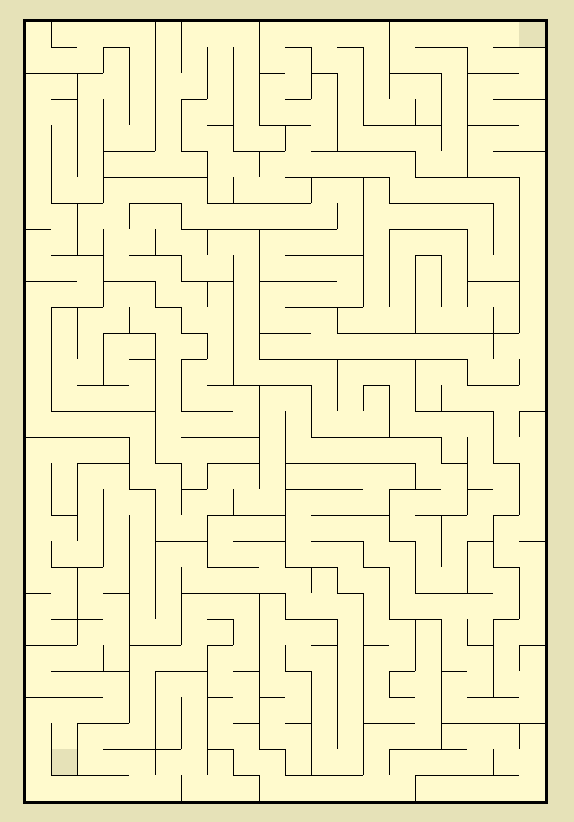
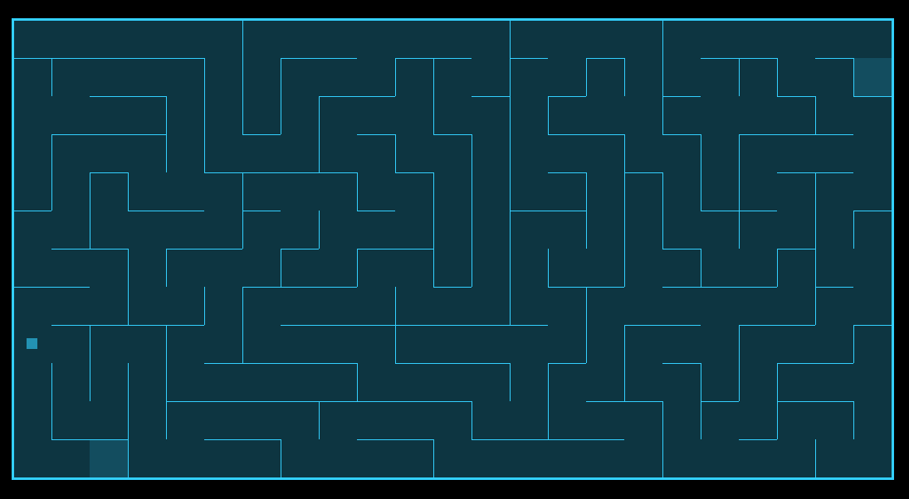
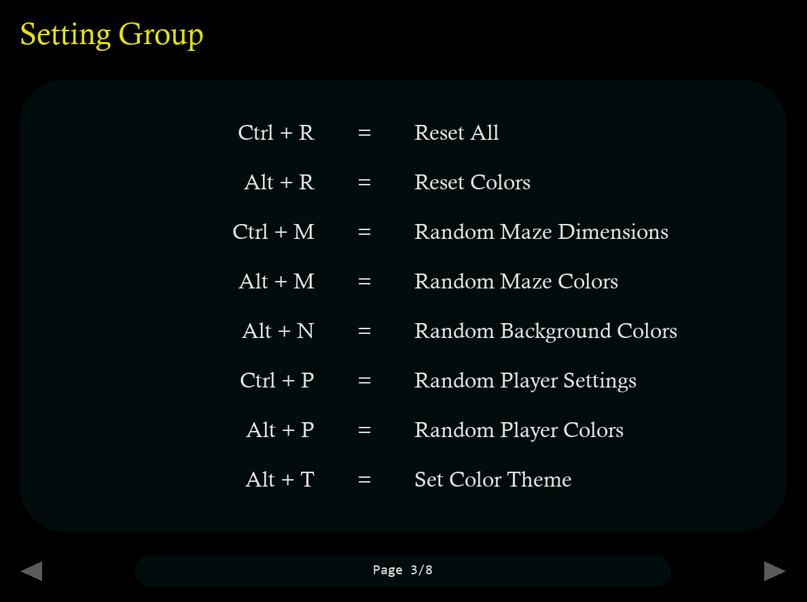

# Maze Generator (with Pygame)

### Overview

A fun and interactive maze generator built using Pygame. This program allows you to generate, play, and customize mazes with a variety of settings. The easy-to-use interface lets you navigate through the maze intuitively, change colors, and even save mazes as printable images.

## Features

- __Maze Generation__: Generates random mazes using a Depth-First Search (DFS).

- __Smooth Navigation__: Use arrow keys or mouse to pan and zoom naturally.

- __Interactive Player__: Control a small character to solve the maze and earn your :crown:.

- __Settings Menu__: Adjust maze and player settings – colors, speed, and more.

- __Help Menu__: Press __ESC__ in-game to view keybindings and controls.

- __Save Mazes__: Export your mazes as images to print or solve offline.

- __Adaptive UI__: Day/night mode, customizable background and borders for a personalized look.


<div style="text-align: center;">
	
</div>


## Installation

1. Clone the repository:

	```bash
	git clone https://github.com/jray-8/maze-generator.git
	```

1. Install Pygame if you don't already have it:

	```bash
	pip install pygame
	```
	
1. Run the program:

	```bash
	python maze_generator.py
	```


	

## Basic Controls

- Generate new maze - `g`

- Toggle play mode - `p`

- Fullscreen toggle - `f`

- Swap day/night background - `n`

- Reset maze/player - `r`

- Randomize theme - `t`

- Save current maze - `ctrl + s`

- Batch save - `ctrl + alt + s`

- Quit program - `ctrl + q`

### __Notes__ 
> For a complete list of controls displayed on organized pages, press __ESC__ to view the in-game help menu.
>
> To change maze settings, press `ctrl + o` and follow the instructions.


